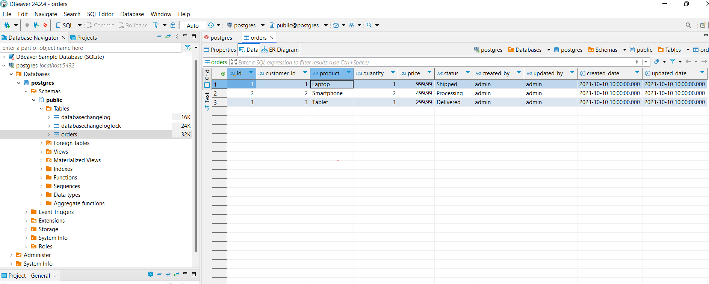

# Order Management System
## Init Data Liquibase


## Deploy Your Spring Boot Application on AWS as Docker Containers

### 1. Build the Docker Image
```sh
docker build -t order-app .
```

### 2. Push the Docker Image to Amazon ECR
```sh
docker tag order-app:latest <aws_account_id>.dkr.ecr.<region>.amazonaws.com/order-app:latest .
docker push <aws_account_id>.dkr.ecr.<region>.amazonaws.com/order-app:latest
```
### 3. Deploy the Docker Container on AWS ECS
```sh
Create a Task Definition
Define a new task definition with the following settings:
Container name: order-app
Image: <aws_account_id>.dkr.ecr.<region>.amazonaws.com/order-app:latest
Port mappings: 8080 (host) -> 8080 (container)
Run the Task
Go to the ECS cluster and run a new task using the task definition created
```
### 4. Access
```sh
IP address of the ECS instance on port 8080
```

