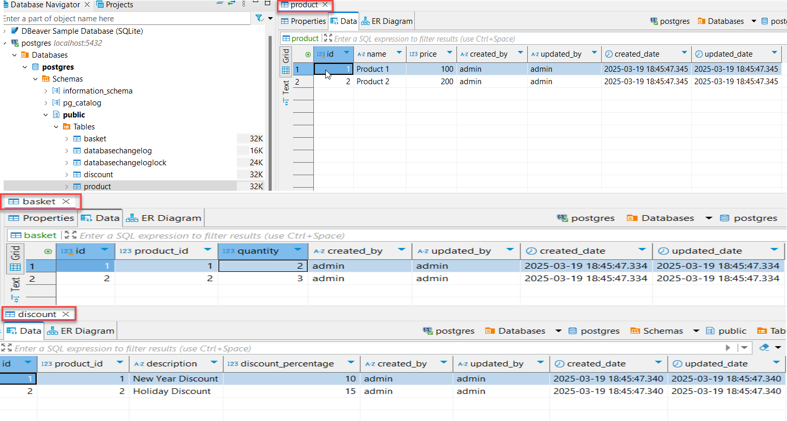

# Altech Product Service
## Database

## Unit test and Intergration test

To start the application and run the tests, you can use the following commands:
Start the Application   
```bash  docker-compose up --build```
Run the Tests
```mvn test```